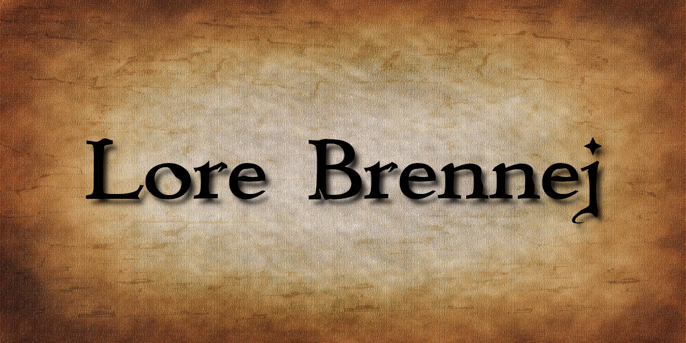

# [Brenna Lore](https://jkgplay.github.io/Lore-Brennej/)

**Strona internetowa o Historii Brennej.** Dowiesz się tutaj czym są smokoważki, gdzie w Brennej ma siedzibę gildia inżynierów albo dlaczego Górki (&#x1F922;) są z<del>j$*#@</del>e. A wszystko to sporządzone zostało przez następujące osoby:
* kolega **Bartek,**
* kolega **Maciej,**
* kolega **Mateusz,**
* kolega **Miłosz,**
* oraz ja, kolega **Janek.**
  
Kontakt: jkgplay2005@gmail.com
